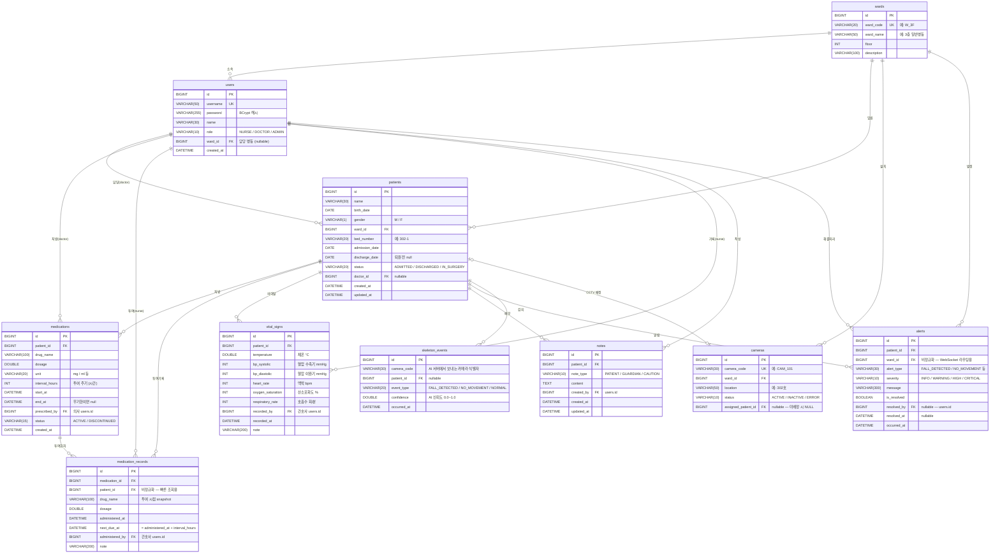

# ERD 설계 문서

## 1. ERD 다이어그램



---

## 2. 테이블 설명

### 2.1 wards (병동)

병원 병동 기준 정보. 모든 환자·카메라·알림의 최상위 소속 단위.

| 컬럼 | 타입 | 제약 | 설명 |
|---|---|---|---|
| id | BIGINT | PK, AUTO_INCREMENT | |
| ward_code | VARCHAR(20) | UNIQUE NOT NULL | 병동 식별 코드. 예) `W_3F` |
| ward_name | VARCHAR(50) | NOT NULL | 표시명. 예) `3층 일반병동` |
| floor | INT | NOT NULL | 층수 |
| description | VARCHAR(100) | | 비고 |

**설계 이유:** WebSocket 알림 발송 경로(`/topic/ward/{wardId}/alerts`)와 병동별 접근 제어의 기준점이 되므로 독립 테이블로 분리했다.

---

### 2.2 users (사용자)

병원 직원 계정. 간호사·의사·관리자 역할을 하나의 테이블로 관리한다.

| 컬럼 | 타입 | 제약 | 설명 |
|---|---|---|---|
| id | BIGINT | PK | |
| username | VARCHAR(50) | UNIQUE NOT NULL | 로그인 아이디 |
| password | VARCHAR(255) | NOT NULL | BCrypt 해시 저장 |
| name | VARCHAR(30) | NOT NULL | 실명 |
| role | VARCHAR(10) | NOT NULL | `NURSE` / `DOCTOR` / `ADMIN` |
| ward_id | BIGINT | FK(wards), NULL | 담당 병동. ADMIN은 NULL |
| created_at | DATETIME | NOT NULL | |

**설계 이유:**
- 역할이 3개뿐이고 공통 속성(이름, 아이디, 비밀번호)이 대부분 동일해 단일 테이블 전략(Single Table) 채택.
- `ward_id`는 `NURSE`/`DOCTOR`만 사용. `ADMIN`은 모든 병동 접근 가능하므로 NULL.

---

### 2.3 patients (환자)

입원 환자 정보. 퇴원 후에도 행을 삭제하지 않고 `status`만 변경한다(소프트 삭제).

| 컬럼 | 타입 | 제약 | 설명 |
|---|---|---|---|
| id | BIGINT | PK | |
| name | VARCHAR(30) | NOT NULL | |
| birth_date | DATE | NOT NULL | |
| gender | VARCHAR(1) | NOT NULL | `M` / `F` |
| ward_id | BIGINT | FK(wards) NOT NULL | 소속 병동 |
| bed_number | VARCHAR(20) | NOT NULL | 예) `302-1` |
| admission_date | DATE | NOT NULL | 입원일 |
| discharge_date | DATE | NULL | 퇴원일. 입원 중에는 NULL |
| status | VARCHAR(20) | NOT NULL | `ADMITTED` / `DISCHARGED` / `IN_SURGERY` |
| doctor_id | BIGINT | FK(users), NULL | 담당 의사 |
| created_at | DATETIME | NOT NULL | |
| updated_at | DATETIME | | |

**설계 이유:**
- 퇴원 후에도 약물·바이탈·알림 이력이 `patient_id`를 참조하므로 물리적 삭제 불가. `status = DISCHARGED`로 논리 삭제.
- `doctor_id`는 nullable — 담당의 미지정 케이스 허용.

---

### 2.4 cameras (CCTV 카메라)

병동 내 CCTV 카메라 정보. AI 서버와의 연결 고리.

| 컬럼 | 타입 | 제약 | 설명 |
|---|---|---|---|
| id | BIGINT | PK | |
| camera_code | VARCHAR(30) | UNIQUE NOT NULL | AI 서버가 이벤트 전송 시 사용하는 식별자. 예) `CAM_101` |
| ward_id | BIGINT | FK(wards) NOT NULL | 설치 병동 |
| location | VARCHAR(50) | | 설치 위치. 예) `302호` |
| status | VARCHAR(10) | NOT NULL | `ACTIVE` / `INACTIVE` / `ERROR` |
| assigned_patient_id | BIGINT | FK(patients), NULL | 현재 모니터링 중인 환자. 미배정 시 NULL |

**설계 이유:**
- 카메라:환자 = 1:1 관계지만, 퇴원 등으로 배정이 수시로 변경되므로 카메라 테이블에 `assigned_patient_id`를 두는 단방향 참조 방식 채택.
- `camera_code`는 AI 서버가 이벤트를 보낼 때 사용하는 키 → AI 서버와의 계약 식별자.

---

### 2.5 medications (처방 약물)

의사가 환자에게 내린 약물 처방 정보.

| 컬럼 | 타입 | 제약 | 설명 |
|---|---|---|---|
| id | BIGINT | PK | |
| patient_id | BIGINT | FK(patients) NOT NULL | |
| drug_name | VARCHAR(100) | NOT NULL | |
| dosage | DOUBLE | NOT NULL | 1회 투여량 |
| unit | VARCHAR(20) | | `mg`, `ml` 등 |
| interval_hours | INT | NOT NULL | 투여 주기 (시간). 예) `8` → 8시간마다 |
| start_at | DATETIME | NOT NULL | 처방 시작 |
| end_at | DATETIME | NULL | 처방 종료. NULL이면 무기한 |
| prescribed_by | BIGINT | FK(users) NOT NULL | 처방 의사 |
| status | VARCHAR(15) | NOT NULL | `ACTIVE` / `DISCONTINUED` |
| created_at | DATETIME | NOT NULL | |

**설계 이유:**
- `interval_hours`를 저장해 투여 기록 생성 시 `next_due_at = administered_at + interval_hours`를 자동 계산하는 데 사용.
- 처방 중단도 소프트 삭제(`DISCONTINUED`) — 이미 생성된 투여 기록이 처방을 참조하므로 물리 삭제 불가.

---

### 2.6 medication_records (투여 기록)

간호사가 약물을 투여할 때마다 생성되는 시계열 이력 테이블.

| 컬럼 | 타입 | 제약 | 설명 |
|---|---|---|---|
| id | BIGINT | PK | |
| medication_id | BIGINT | FK(medications) NOT NULL | 처방 참조 |
| patient_id | BIGINT | FK(patients) NOT NULL | **비정규화** — 빠른 조회용 |
| drug_name | VARCHAR(100) | NOT NULL | **snapshot** — 처방 변경 대비 |
| dosage | DOUBLE | NOT NULL | 실제 투여량 |
| administered_at | DATETIME | NOT NULL | 실제 투여 시각 |
| next_due_at | DATETIME | NULL | 다음 투여 예정 시각 |
| administered_by | BIGINT | FK(users) NOT NULL | 투여 간호사 |
| note | VARCHAR(200) | | 특이사항 |

**설계 이유:**
- `patient_id` 비정규화: 스케줄러가 `findOverdueMedications()` 쿼리에서 `patient_id`로 환자를 바로 찾아야 하므로, `medications` 테이블 조인 없이 조회 가능하도록 중복 저장.
- `drug_name` snapshot: 처방이 변경되거나 중단되더라도 "언제 어떤 약을 투여했는지" 기록이 불변해야 하므로 투여 시점의 이름을 복사.
- `next_due_at`: 스케줄러가 이 값과 현재 시각을 비교해 기한 초과를 판단.

---

### 2.7 vital_signs (바이탈 사인)

체온·혈압·산소포화도 등 측정값. 수정 없이 append-only로 운영하는 시계열 데이터.

| 컬럼 | 타입 | 제약 | 설명 |
|---|---|---|---|
| id | BIGINT | PK | |
| patient_id | BIGINT | FK(patients) NOT NULL | |
| temperature | DOUBLE | NULL | 체온 °C |
| bp_systolic | INT | NULL | 혈압 수축기 mmHg |
| bp_diastolic | INT | NULL | 혈압 이완기 mmHg |
| heart_rate | INT | NULL | 맥박 bpm |
| oxygen_saturation | INT | NULL | 산소포화도 % |
| respiratory_rate | INT | NULL | 호흡수 회/분 |
| recorded_by | BIGINT | FK(users) NOT NULL | 기록 간호사 |
| recorded_at | DATETIME | NOT NULL | |
| note | VARCHAR(200) | | |

**설계 이유:**
- 혈압 수축기·이완기를 별도 컬럼으로 분리 → 수축기만으로 이상 범위 계산 가능.
- 모든 측정 항목을 NULL 허용 — 체온만 측정하고 혈압은 다음에 측정하는 경우도 1건의 기록으로 처리.
- 그래프용 시계열 조회: `recorded_at` 오름차순 인덱스 활용.

---

### 2.8 notes (메모)

환자·보호자·주의사항을 자유 형식으로 기록하는 테이블.

| 컬럼 | 타입 | 제약 | 설명 |
|---|---|---|---|
| id | BIGINT | PK | |
| patient_id | BIGINT | FK(patients) NOT NULL | |
| note_type | VARCHAR(10) | NOT NULL | `PATIENT` / `GUARDIAN` / `CAUTION` |
| content | TEXT | NOT NULL | 메모 내용 (무제한 길이) |
| created_by | BIGINT | FK(users) NOT NULL | 작성자 |
| created_at | DATETIME | NOT NULL | |
| updated_at | DATETIME | | |

**설계 이유:**
- `content` 컬럼을 TEXT로 설정 — 간호 메모는 길이 예측이 어려워 VARCHAR 대신 TEXT 사용.
- `note_type`으로 필터링 가능 — 예) 주의사항(CAUTION)만 별도 섹션에 표시.

---

### 2.9 alerts (알림 이력)

실시간 알림의 발생 이력. 발생 즉시 DB에 저장하고 WebSocket으로도 발송한다.

| 컬럼 | 타입 | 제약 | 설명 |
|---|---|---|---|
| id | BIGINT | PK | |
| patient_id | BIGINT | FK(patients) NOT NULL | |
| ward_id | BIGINT | FK(wards) NOT NULL | **비정규화** — WebSocket 라우팅용 |
| alert_type | VARCHAR(30) | NOT NULL | `FALL_DETECTED` / `NO_MOVEMENT` / `MEDICATION_OVERDUE` / `MEDICATION_DUE_SOON` / `ABNORMAL_VITAL` |
| severity | VARCHAR(10) | NOT NULL | `INFO` / `WARNING` / `HIGH` / `CRITICAL` |
| message | VARCHAR(300) | NOT NULL | 간호사에게 표시될 메시지 |
| is_resolved | BOOLEAN | NOT NULL, DEFAULT false | 해결 여부 |
| resolved_by | BIGINT | FK(users), NULL | 해결한 사용자 |
| resolved_at | DATETIME | NULL | |
| occurred_at | DATETIME | NOT NULL | |

**설계 이유:**
- `ward_id` 비정규화: WebSocket 발송 시 `AlertService`가 `patients` 테이블을 조회해서 `wardId`를 가져오지만, 알림 이력 조회(`GET /api/alerts/ward/{wardId}`)에서 매번 환자 테이블을 조인하지 않으려고 중복 저장.
- `is_resolved` + `resolved_by` + `resolved_at` 3개 컬럼으로 해결 이력 추적 — 누가 언제 확인했는지 감사 로그 역할.

---

### 2.10 skeleton_events (스켈레톤 분석 이벤트)

AI 서버(COME-HVLM)로부터 수신한 분석 결과를 저장하는 이력 테이블.

| 컬럼 | 타입 | 제약 | 설명 |
|---|---|---|---|
| id | BIGINT | PK | |
| camera_code | VARCHAR(30) | NOT NULL | AI 서버가 보내는 카메라 식별자 |
| patient_id | BIGINT | FK(patients), NULL | 카메라 배정에서 역으로 조회 |
| event_type | VARCHAR(20) | NOT NULL | `FALL_DETECTED` / `NO_MOVEMENT` / `NORMAL` |
| confidence | DOUBLE | NOT NULL | AI 예측 신뢰도 (0.0 ~ 1.0) |
| occurred_at | DATETIME | NOT NULL | AI 서버 판단 발생 시각 |

**설계 이유:**
- `camera_code` 그대로 저장 — AI 서버와의 계약 식별자. `camera_id(FK)`로 바꾸면 카메라 삭제 시 이력이 깨짐.
- `patient_id` nullable: AI 서버가 `patientId`를 보내지 않으면 백엔드가 카메라 배정 테이블에서 조회해 채움. 배정이 없으면 NULL.
- 이벤트를 전량 저장 — `NORMAL` 이벤트도 포함. 향후 활동 패턴 분석·이상 행동 감지 ML 학습 데이터로 활용 가능.

---

## 3. 테이블 간 관계 정리

```
wards (1) ──────────── (N) users           소속 병동
wards (1) ──────────── (N) patients        입원 병동
wards (1) ──────────── (N) cameras         설치 병동
wards (1) ──────────── (N) alerts          알림 발생 병동

users (1) ──────────── (N) patients        담당 의사 (doctor_id)
users (1) ──────────── (N) medications     처방 의사 (prescribed_by)
users (1) ──────────── (N) medication_records  투여 간호사 (administered_by)
users (1) ──────────── (N) vital_signs     기록 간호사 (recorded_by)
users (1) ──────────── (N) notes           작성자 (created_by)
users (1) ──────────── (N) alerts          해결 처리자 (resolved_by)

patients (1) ────────── (N) medications        처방 목록
patients (1) ────────── (N) medication_records 투여 이력
patients (1) ────────── (N) vital_signs        바이탈 이력
patients (1) ────────── (N) notes              메모 이력
patients (1) ────────── (N) alerts             알림 이력
patients (1) ────────── (N) skeleton_events    AI 감지 이력
patients (1) ────────── (0..1) cameras         CCTV 배정

medications (1) ──────── (N) medication_records  처방별 투여 회차
```

---

## 4. 설계 주요 결정 사항

### 4.1 JPA @ManyToOne 대신 ID만 저장한 이유

모든 외래 키를 `@ManyToOne` JPA 연관관계 대신 `Long wardId`, `Long patientId` 형태의 **ID 참조**로 구현했다.

- **이유:** 도메인 간 결합도를 낮추기 위해서. 예) `Patient`를 조회할 때 `Ward` 엔티티가 EAGER 로딩되지 않아 불필요한 쿼리를 방지.
- **트레이드오프:** 조인이 필요한 경우 서비스 레이어에서 Repository를 직접 호출해야 함. 쿼리 수가 늘어날 수 있어 대시보드처럼 N+1이 우려되는 곳은 최적화 필요.

### 4.2 비정규화를 허용한 두 곳

| 테이블 | 비정규화 컬럼 | 이유 |
|---|---|---|
| `medication_records` | `patient_id`, `drug_name` | 스케줄러 기한 초과 쿼리 최적화, 처방 변경 이후에도 투여 이력 불변 보장 |
| `alerts` | `ward_id` | 알림 이력 조회 시 `patients → ward_id` 조인 제거 |

### 4.3 소프트 삭제 전략

물리 삭제 대신 status 컬럼으로 논리 삭제를 적용한 테이블:

| 테이블 | 컬럼 | 삭제 상태 값 |
|---|---|---|
| `patients` | `status` | `DISCHARGED` |
| `medications` | `status` | `DISCONTINUED` |

나머지 테이블(`vital_signs`, `medication_records`, `skeleton_events`)은 append-only — 삭제 기능 자체가 없는 이력성 데이터.

### 4.4 시계열 테이블 인덱스 권장

운영 환경에서 다음 인덱스 추가를 권장:

```sql
-- 환자별 최신 바이탈 조회 (대시보드에서 자주 사용)
CREATE INDEX idx_vital_patient_recorded ON vital_signs (patient_id, recorded_at DESC);

-- 스케줄러의 기한 초과 감지 쿼리 최적화
CREATE INDEX idx_medrecord_next_due ON medication_records (next_due_at);

-- 알림 미해결 목록 조회
CREATE INDEX idx_alert_ward_resolved ON alerts (ward_id, is_resolved, occurred_at DESC);

-- 스켈레톤 이벤트 NO_MOVEMENT 30분 연속 감지
CREATE INDEX idx_skeleton_patient_type_time ON skeleton_events (patient_id, event_type, occurred_at);
```
